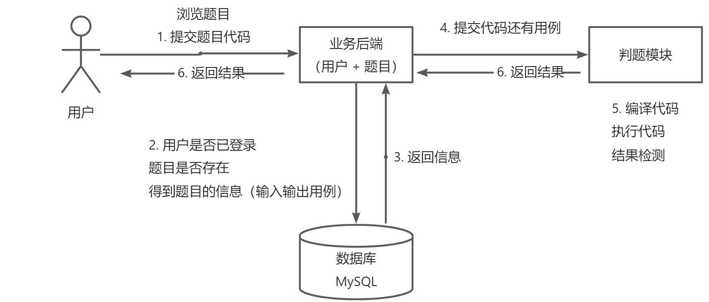
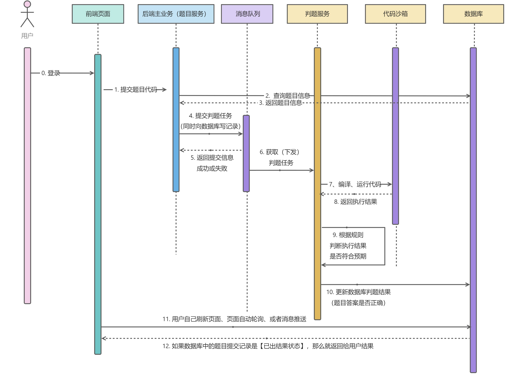

# 龙虾OJ在线判题系统

---

## 项目介绍

基于Spring Cloud微服务+RabbitMQ+Docker的编程题目评测系统。系统能够根据管理员预设的题目用例对用户提交的代码进行执行和评测；系统中自主实现的代码沙箱可作为独立服务供其他开发者调用。

## 核心业务流程

## 核心功能

1. 题目模块
   
   i. 创建题目（管理员）
   ii. 删除题目（管理员）
   iii. 修改题目（管理员）
   iv. 搜索题目（用户）
   v. 在线做题
   vi. 提交题目代码
2. 用户模块
   
   i. 注册
   ii. 登录
3. 判题模块
   
   i. 提交判题（结果是否正确与错误）
   ii. 错误处理（内存溢出、安全性、超时）
   iii. **自主实现** 代码沙箱（安全沙箱）
   iv. 开放接口（提供一个独立的新服务）

## 技术选型

Java 进程控制、Java 安全管理器、部分 JVM 知识点

虚拟机（云服务器）、Docker（代码沙箱实现）

Spring Cloud 微服务 、消息队列、多种设计模式